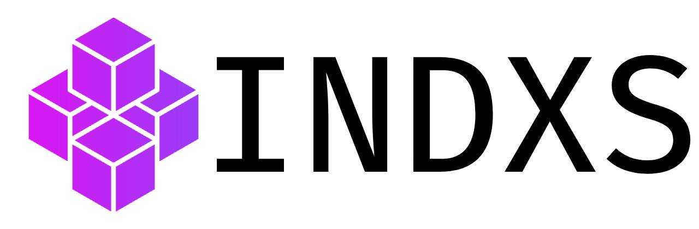

# Indxs - The Open-Source Package Index 🚀



**_"From Developers, For Developers."_**

Welcome to **Indxs**, an open-source platform that helps developers discover and explore packages and libraries across different programming languages and frameworks.

<!-- TODO: uncomment later -->
<!-- [](https://github.com/Indxs/indxs)
[](https://github.com/Indxs/indxs) -->

🔗 **Project Link:** [Indxs.dev](https://indxs.dev)

---

## 📚 Table of Contents
- [About Indxs](#-about-indxs)
- [Getting Started](#-getting-started)
- [Installation](#-installation)
- [Usage](#-usage)
- [How to Contribute](#-how-to-contribute)
- [Security & Issues](#-security--issues)
- [License](#-license)
- [Community & Support](#-community--support)
- [Show Your Support](#-show-your-support)

---

## 📖 About Indxs

**Indxs** is an open-source project that serves as a package index for multiple programming languages and frameworks. It allows developers to:  
✅ Discover high-quality packages.  
✅ Search & filter libraries easily.  
✅ Contribute by submitting new packages (Soon).  
✅ Review and improve package listings.

Built using:
- **Laravel** (Backend API)
- **Inertia.js** (Bridging Laravel & React)
- **React.js** (Frontend UI)
- **Tailwind CSS** (Styling)
- **TypeScript** (For maintainability)

We are currently focusing on **PHP & Laravel packages**, with plans to expand to other languages in the future.

---

## 🚀 Getting Started

Follow these steps to set up **Indxs** on your local machine.

### Prerequisites
Make sure you have the following installed:
- **PHP 8.2+**
- **Composer**
- **Node.js 18+ & npm**
- **MySQL or PostgreSQL**
- **Git**

---

## 🛠 Installation

### 1️⃣ Clone the repository
```sh
git clone https://github.com/Indxs/indxs.git
cd indxs
```

### 2️⃣ Install dependencies

```sh
composer install
npm install
```

### 3️⃣ Set up environment variables

```sh
cp .env.example .env
php artisan key:generate
```

Configure your database settings inside .env.

### 4️⃣ Run Migrations

```sh
php artisan migrate --seed
```

### 5️⃣ Start the development server

```sh
composer run dev
```

---

## 🎯 Usage
Once the project is running, open your browser and visit:

```plaintext
http://localhost:8000
```

You can start exploring packages, submitting new ones, and contributing to the project!

---

## 🤝 How to Contribute
We love community contributions! To contribute:

1️⃣ Fork the repository
2️⃣ Create a new branch (feature/your-feature-name)
3️⃣ Commit your changes (git commit -m "Add new feature")
4️⃣ Push your branch (git push origin feature/your-feature-name)
5️⃣ Create a Pull Request on GitHub

---

## 🔐 Security & Issues
If you find a security vulnerability, do not open a public issue. Instead, please report it to:

📧 [indxs.dev@gmail.com](mailto:indxs.dev@gmail.com)

For general bugs, feel free to open an issue in the [GitHub Issues](https://github.com/Indxs/indxs/issues) section.

---

## 📜 License

This project is open-source under the MIT License. Feel free to use and modify it as needed.

---

## 💬 Community & Support
Join the Indxs community to stay updated:

GitHub Discussions: [Join here](https://github.com/Indxs/indxs/discussions)
Twitter/X: [@IndxsDev](https://x.com/IndxsDev)
Email: [indxs.dev@gmail.com](mailto:indxs.dev@gmail.com)

---

## ⭐ Show Your Support
If you find this project useful:

- Give us a ⭐ Star on GitHub!
- Follow us on X/Twitter [@IndxsDev](https://x.com/IndxsDev) for updates
- Follow the organization [@Indxs](https://github.com/Indxs)
- Share **Indxs.dev** with fellow developers!

🚀 Let's build the best open-source package index together!
