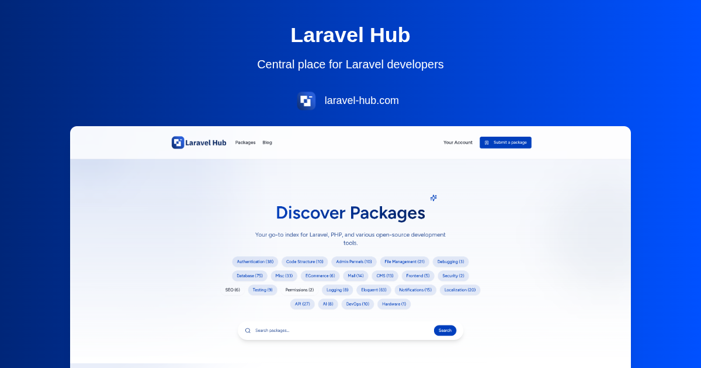

# Laravel Hub – The Central Community for Laravel Developers



**_"From Developers, For Developers."_**

[Laravel Hub](https://laravel-hub.com) is the central hub for Laravel developers — a platform that goes beyond a package directory to offer a full-featured community experience.

It brings together curated blog posts, tutorials, packages, news, and multi-format community content (like videos, podcasts, and test articles), all in one place.

<!-- TODO: uncomment later -->
<!-- [](https://github.com/theLaravelHub/laravel-hub)
[](https://github.com/theLaravelHub/laravel-hub) -->

**Project Link:** [Laravel-Hub.com](https://laravel-hub.com)

---

## Table of Contents

- [About Laravel Hub](#about-laravel-hub)
- [Getting Started](#getting-started)
- [Installation](#installation)
- [Usage](#usage)
- [How to Contribute](#how-to-contribute)
- [Security & Issues](#security--issues)
- [License](#license)
- [Community & Support](#community--support)
- [Show Your Support](#show-your-support)

---

## About Laravel Hub

**Laravel Hub** is a modern, open-source platform and Laravel community designed to help developers:

- Stay up to date with curated articles, news, videos, and podcasts  
- Submit and showcase their own packages and posts  
- Engage with others by commenting, replying, and following topics  
- Bookmark posts and explore trending content

Built using:

- **Laravel** (Backend API)
- **Inertia.js** (Bridging Laravel & React)
- **React.js** (Frontend UI)
- **Tailwind CSS** (Styling)
- **TypeScript** (Maintainable frontend)

Laravel Hub is the go-to destination for Laravel developers who want to learn, share, and grow within the ecosystem.

---

## Getting Started

Follow these steps to set up **Laravel Hub** on your local machine.

### Prerequisites

Make sure you have the following installed:

- **PHP 8.3+**
- **Composer**
- **Node.js 18+ & npm**
- **MySQL or PostgreSQL**
- **Git**

---

## Installation

### 1️⃣ Clone the repository

```sh
git clone https://github.com/theLaravelHub/laravel-hub.git
cd laravel-hub
````

### 2️⃣ Install dependencies

```sh
composer install
npm install
```

### 3️⃣ Set up environment variables

```sh
cp .env.example .env
php artisan key:generate
```

Configure your database settings in the `.env` file.

### 4️⃣ Run Migrations

```sh
php artisan migrate --seed
```

### 5️⃣ Start the development server

```sh
composer run dev
```

---

## Usage

Once the project is running, open your browser and visit:

```plaintext
http://localhost:8000
```

You can explore packages, read blog posts, submit your own content, and participate in the Laravel community.

---

## How to Contribute

We welcome contributions from the Laravel community. Here's how to get started:

1. Fork the repository
2. Create a new branch: `feature/your-feature-name`
3. Make your changes
4. **Before committing or pushing**, run the following command to format your code:

```sh
composer run format
```

5. Also, make sure all tests pass by running:

```sh
./vendor/bin/phpunit
```

6. Push your branch:

```sh
git push origin feature/your-feature-name
```

7. Open a Pull Request and describe your changes

Thank you for helping improve Laravel Hub!

---

## Security & Issues

If you discover a security vulnerability, please **do not** open a public issue. Instead, contact us directly at:

[thefeqy@gmail.com](mailto:thefeqy@gmail.com)

For bugs or feature requests, open an issue on [GitHub](https://github.com/theLaravelHub/laravel-hub/issues).

---

## License

This project is open-source under the **MIT License**.
You’re free to use, modify, and distribute it.

---

## Community & Support

Stay connected with the Laravel Hub community:

* GitHub Discussions: [Start a discussion](https://github.com/theLaravelHub/laravel-hub/discussions)
* Twitter/X: [@thelaravelhub](https://x.com/thelaravelhub)
* Email: [thefeqy@gmail.com](mailto:thefeqy@gmail.com)

---

## Show Your Support

If you find Laravel Hub useful:

* ⭐ Star the project on GitHub
* 📰 Share Laravel-Hub.com with your network
* 🧠 Follow us on [Twitter/X](https://x.com/thelaravelhub)
* 🔍 Contribute your own packages and blog posts

Together, let's grow the Laravel community.
